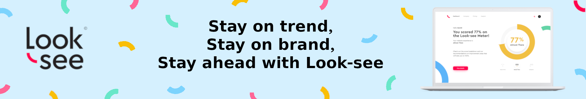
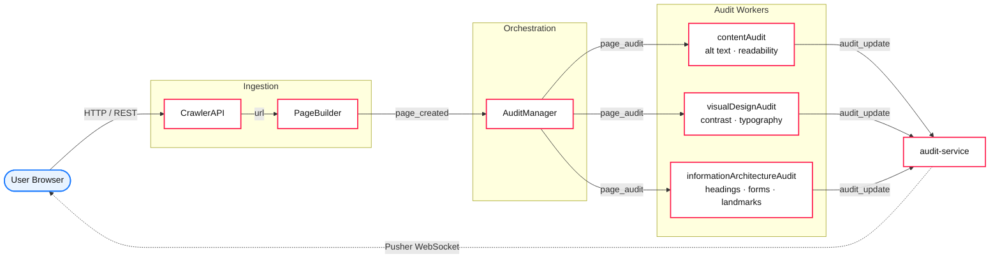
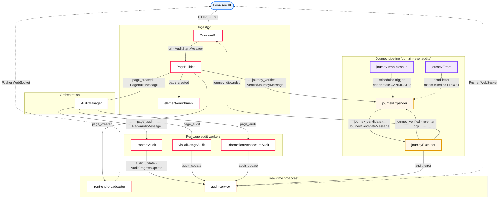

<!--
  Meta keywords for search engines & GitHub topics:
  WCAG 2.2, WCAG 2.1, accessibility audit, a11y, ADA compliance, Section 508,
  automated accessibility testing, color contrast checker, alt text audit,
  screen reader testing, keyboard navigation, axe alternative, Pa11y alternative,
  Lighthouse accessibility, Angular, Spring Boot, Neo4j, headless browser,
  Selenium, WCAG scanner, inclusive design, EN 301 549
-->

<p align="center">
  <a href="https://deepthought42.github.io/Accessibility-audit-platform/">
    
  </a>
</p>

<h1 align="center">Look-see — Automated WCAG 2.2 Accessibility Audit Platform</h1>

<p align="center">
  <strong>Look-see reads your website the way a user does — in HTML, in rendered pixels, and across the journeys between pages. Then it tells you where it falls apart.</strong>
</p>

<p align="center">
  <a href="LICENSE"></a>
  
  
  
  
  
  
  
  
</p>

<p align="center">
  
  <!-- TODO(design): replace with a bespoke a11y-superhero hero image pairing the Look-see logo with WCAG category icons. -->
</p>

<p align="center">
  <a href="#quick-start">Quick start</a> ·
  <a href="#what-look-see-audits">What it audits</a> ·
  <a href="#architecture">Architecture</a> ·
  <a href="#deploy-to-your-own-cloud">Deploy</a> ·
  <a href="#roadmap">Roadmap</a> ·
  <a href="https://deepthought42.github.io/Accessibility-audit-platform/">Project site</a>
</p>

---

## What is Look-see?

**Look-see is an open-source accessibility audit platform.** It crawls your site, drives it in a real headless browser, and grades every page against **WCAG 2.2 / 2.1 AA**, **ADA**, **Section 508**, and **EN 301 549**. Unlike one-page scanners, it follows the journeys users actually take — clicking, navigating, and validating end-to-end flows — so the issues it reports are the ones a real visitor would hit.

Under the hood it's a monorepo of small services: a crawler API, a page builder, four specialized audit workers (content, visual design, information architecture, journeys), an Angular UI, a Chrome extension, and a VS Code extension for real-time feedback in your editor. They trade work over Google Cloud Pub/Sub and describe the site in a Neo4j graph.

## Where we are

Look-see is **engineered in public** and isn't 1.0 yet. The services below are real and runnable, but the project is still being stitched together — not a polished hosted product. Expect rough edges, roadmap items that are sketched before they're wired up, and docs that occasionally describe intent before they describe reality.

For the current cadence, skim the [commits](https://github.com/deepthought42/Accessibility-audit-platform/commits/main) and [open issues](https://github.com/deepthought42/Accessibility-audit-platform/issues). A hosted version at [look-see.com](https://deepthought42.github.io/Accessibility-audit-platform/) is planned but not live; self-hosting is the supported path today.

If that sounds more interesting than it sounds like a warning, you're in the right place. PRs welcome. Bug reports from real websites especially welcome.

## Why it's unusual

**It looks at pixels, not only at HTML.** Most accessibility tools parse the DOM and stop there. Look-see also renders the page and audits the output a user actually sees — contrast measured from the paint on screen, not from stylesheet rules that may be overridden. A page can pass every rule-based checker and still be unreadable: light grey on white, a font that computed to 10px, a button that vanishes below a sticky banner. The visual-design service sees what a user sees.

**It audits journeys, not just URLs.** Modern applications are state machines. Auditing the landing page is like inspecting a theatre by its lobby. Look-see discovers interactive elements, drives a real headless browser through them, and audits the states you only reach by clicking — mid-login, mid-checkout, mid-search.

**It's a graph, not a list.** The site is stored in Neo4j, so pages, elements, journeys, and issues relate the way they actually do in a product. Ask it "which heading hierarchy violations affect which user journeys?" and it has an answer, not a spreadsheet.

**It meets developers where they work.** Chrome extension, VS Code extension, Angular dashboard — the same audit data, three surfaces. Live scores arrive over WebSocket as workers finish, so you watch the audit happen instead of waiting for a PDF.

**It's MIT-licensed and self-hostable.** One `terraform apply` on GCP and your data never leaves your cloud. That matters for compliance teams and for anyone who's been burned by a vendor rug-pull.

## What Look-see audits

Every page is scored across four WCAG-aligned categories:

| Category | WCAG success criteria covered | Example checks |
|---|---|---|
| **Visual Design** | 1.4.1 Use of Color · 1.4.3 Contrast (Minimum) · 1.4.6 Contrast (Enhanced) · 1.4.11 Non-text Contrast · 1.4.12 Text Spacing | Color contrast (AA & AAA), typography scale, image quality, whitespace, imagery contrast |
| **Content** | 1.1.1 Non-text Content · 3.1.5 Reading Level · 1.3.1 Info & Relationships | Alt text presence & quality, readability grade, paragraph structure, plain-language |
| **Information Architecture** | 1.3.1 Info & Relationships · 2.4.6 Headings & Labels · 3.3.2 Labels or Instructions · 4.1.2 Name/Role/Value | Heading hierarchy, table semantics, form labels, link text, landmarks, page metadata |
| **Journeys** | 2.1.1 Keyboard · 2.4.3 Focus Order · 2.4.7 Focus Visible · 3.2.2 On Input | Keyboard reachability, focus order, interactive element discovery, multi-step flow validation |

## Who it's for

- **Accessibility leads & a11y consultants** who need repeatable, auditable WCAG reports across large sites.
- **Product & engineering teams** shipping under ADA, Section 508, or European Accessibility Act deadlines.
- **Agencies** running periodic audits for clients, with white-labelable reports.
- **Open-source maintainers** who want a Pa11y / axe-core alternative that handles full user journeys, not just static pages.

## Quick Start

### Prerequisites

- **Java 17+** (Eclipse Temurin recommended; `CrawlerAPI` requires Java 21)
- **Maven 3.9+**
- **Node.js 18.19+** and **npm 10+** (for the Angular UI)
- **Neo4j** 5.x (local Docker is fine)
- **Docker** (optional, for containerized runs)
- **Google Cloud SDK** (optional, only for GCP integrations like Vision/NLP)

### 1. Clone and build the shared core

All Java services depend on the `LookseeCore` library — build it once, locally.

```bash
git clone https://github.com/deepthought42/Accessibility-audit-platform.git
cd Accessibility-audit-platform
(cd LookseeCore && mvn clean install -DskipTests)
```

### 2. Run a service

```bash
cd AuditManager                       # or any other service directory
mvn clean package -DskipTests
java -ea -jar target/*.jar            # -ea enables Design-by-Contract assertions
```

### 3. Run the web UI

```bash
cd Look-see-UI-v3
npm install
ng serve
# open http://localhost:4200
```

### 4. Run anything in Docker

Every backend service ships a `Dockerfile`:

```bash
cd <service-directory>
docker build -t looksee/<service-name> .
docker run -p 8080:8080 looksee/<service-name>
```

## Architecture

Look-see is a pub/sub-driven monorepo. A single **CrawlerAPI** fronts the platform; work flows asynchronously through Google Cloud Pub/Sub topics to specialized workers, then back to the UI over a Pusher WebSocket.



**Shared across every Java service: [LookseeCore](LookseeCore/)** (`A11yCore` Maven artifact) — Neo4j models, Spring Data repositories, Selenium WebDriver automation, GCP integrations (Storage, Vision, NLP, Pub/Sub), and Pusher broadcasting.

> For the full pub/sub topic list, message payloads, and journey-pipeline diagram, see the expanded [Architecture details](#architecture-details) below.

## Packages

Each top-level directory is a service or library. Click through for service-specific docs.

### Backend services (Spring Boot)

| Service | Role | Java |
|---|---|---|
| [`CrawlerAPI`](CrawlerAPI/) | Public REST API — web crawling, domains, users, billing | 21 |
| [`PageBuilder`](PageBuilder/) | Builds page state models from crawled URLs with headless Chrome | 17 |
| [`AuditManager`](AuditManager/) | Orchestrates page audit lifecycle; routes pub/sub events | 17 |
| [`contentAudit`](contentAudit/) | Alt text, readability, paragraph structure | 17 |
| [`visualDesignAudit`](visualDesignAudit/) | Color contrast, typography, imagery, whitespace | 17 |
| [`informationArchitectureAudit`](informationArchitectureAudit/) | Headings, tables, forms, links, metadata | 17 |
| [`audit-service`](audit-service/) | Processes audit progress and broadcasts live updates | 17 |
| [`look-see-front-end-broadcaster`](look-see-front-end-broadcaster/) | Pushes `page_created` and `audit_update` events to the UI | 17 |
| [`element-enrichment`](element-enrichment/) | Enriches elements with visual and semantic metadata | 17 |
| [`journeyExecutor`](journeyExecutor/) | Executes and validates user journey paths | 17 |
| [`journeyExpander`](journeyExpander/) | Expands verified journeys by discovering interactive elements | 17 |
| [`journey-map-cleanup`](journey-map-cleanup/) | Cleans stale journey candidates in domain maps | 17 |
| [`journeyErrors`](journeyErrors/) | Dead-letter handler for failed journey candidates | 17 |

### Libraries, UIs, and extensions

| Package | Role |
|---|---|
| [`LookseeCore`](LookseeCore/) | Shared core library — models, persistence, browser, GCP, messaging |
| [`Look-see-UI-v3`](Look-see-UI-v3/) | Angular 17 web dashboard |
| [`LookseeChromeExtension`](LookseeChromeExtension/) | Chrome extension for in-page accessibility issue detection |
| [`look-see-VSCode-plugin`](look-see-VSCode-plugin/) | VS Code extension for real-time WCAG 2.2 analysis in the editor |
| [`LookseeIaC`](LookseeIaC/) | Terraform IaC for GCP deployment |
| [`page-audit-enrichment`](page-audit-enrichment/) | Page audit data enrichment utilities |
| [`qa-testbed`](qa-testbed/) | QA test fixture pages for accessibility testing |

## Tech Stack

| Layer | Technology |
|---|---|
| Backend services | Java 17 / 21, Spring Boot 2.6, Maven |
| Shared library | `LookseeCore` (`A11yCore` Maven artifact) |
| Database | Neo4j (graph) via Spring Data Neo4j |
| Messaging | Google Cloud Pub/Sub (async) · Pusher (real-time WebSocket) |
| Browser automation | Selenium WebDriver 3.141.59 |
| Cloud platform | Google Cloud — Cloud Run, Storage, Vision, NLP, Secret Manager |
| Frontend | Angular 17, TypeScript 5.5, Tailwind CSS, Angular Material |
| Authentication | Auth0 (OAuth2 / JWT) |
| Payments | Stripe (subscription billing) |
| Analytics | Segment |
| Infrastructure | Terraform (GCP), GitHub Actions (CI/CD) |
| Container runtime | Docker, Google Cloud Run |

## Deploy to your own cloud

Look-see deploys to **Google Cloud Run** via a single Terraform package. See the full deployment guide — required variables, Secret Manager wiring, Pub/Sub topics, and a sample GitHub Actions workflow — in:

→ **[LookseeIaC/GCP/README.md](LookseeIaC/GCP/README.md)**

## CI/CD

The monorepo CI (`.github/workflows/ci.yml`) uses path-based change detection to build and test only affected modules. Each service also ships its own workflows:

- **`docker-ci-test.yml`** — on PR: build, test, Docker build verification
- **`docker-ci-release.yml`** — on merge to `main`: test, semantic version bump, Docker image push to Docker Hub

## Roadmap

- 🌐 **[look-see.com](https://deepthought42.github.io/Accessibility-audit-platform/)** — hosted SaaS launch (coming soon)
- 📊 **Trend dashboards** — score deltas over time per page and per journey
- 🤖 **Auto-fix suggestions** — LLM-generated remediation PRs
- 🌍 **PDF & Office document audits** — go beyond the browser
- 🏷️ **White-label reports** — for agencies and consultants

Follow the [Issues](https://github.com/deepthought42/Accessibility-audit-platform/issues) tab to track progress.

## Contributing

PRs are very welcome. Good first issues are tagged in each service's repo. Please:

1. Fork and branch from `main`.
2. Run `mvn install -DskipTests` in `LookseeCore` before building any dependent service.
3. Keep changes scoped to one service where possible — CI will only rebuild what you touched.
4. Enable Java assertions (`-ea`) when running locally; Look-see uses Design-by-Contract checks.

## License

Look-see is released under the [MIT License](LICENSE). © 2024–2026 Look-see contributors.

Individual subdirectories may retain their original Apache 2.0 license files from before the monorepo migration; the MIT license at the repository root governs the project as a whole going forward.

---

## Architecture details

### Pub/Sub message flow

Full system view — the page-audit pipeline, the journey pipeline, dead-letter handling, and real-time broadcasting to the UI.



### Key Pub/Sub topics

| Topic | Publishers | Subscribers | Payload |
|---|---|---|---|
| `url` | CrawlerAPI | PageBuilder | `AuditStartMessage` (URL, audit level, account) |
| `page_created` | PageBuilder | AuditManager, front-end-broadcaster | `PageBuiltMessage` (account, page, audit record IDs) |
| `page_audit` | AuditManager | contentAudit, visualDesignAudit, informationArchitectureAudit | `PageAuditMessage` (page audit, page, account IDs) |
| `audit_update` | Audit services | audit-service | `AuditProgressUpdate` (progress, category, status) |
| `audit_error` | All services | (logging/monitoring) | Error details |
| `journey_verified` | PageBuilder, journeyExecutor | journeyExpander | `VerifiedJourneyMessage` (journey, account, audit record) |
| `journey_candidate` | journeyExpander | journeyExecutor | `JourneyCandidateMessage` (journey, browser, map) |
| `journey_discarded` | journeyExecutor | CrawlerAPI | `DiscardedJourneyMessage` |
| `journey_completion_cleanup` | (scheduled) | journey-map-cleanup | Trigger payload |

### Monorepo history

Each top-level directory is a former standalone repository. Former `origin` URLs are listed in [`LEGACY_REMOTES.txt`](LEGACY_REMOTES.txt) for reference. The monorepo uses a **single new history** at the root (per-repo commit histories are not included). To preserve old SHAs, clone the URLs in `LEGACY_REMOTES.txt` into separate folders or use `git filter-repo` to replay histories under subdirectories.
